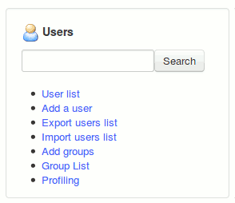

# Extra Chamilo fields {#extra-chamilo-fields}

If you ever wonder where those « original\_user\_id » values we saw in the webservices chapter were stored, have a look at the « \*\_field » tables. You'll find that users, courses \(since 1.9.0\) and even sessions \(since 1.10.0\) all have two « extra » tables that allow us to store a virtually-unlimited amount of additional information and links to other systems.

For users, it's easy : you can define fields through the administration panel. Just click the last link of the users block : « Profiling » and follow the instructions to define a new field.

Since 1.10.0, the admin panel offers the possibility to configure additional course and session fields.

For users, courses and sessions, however, the fields were already available in the Chamilo 1.9 database, so you **c\*\***ould\*\* use them if you wanted. Actually, web services already used them when creating a new course or a new session through them : they create \(or insert data into it if it exists\) a field by the name of the value you gave in the « original\_course\_id\_name » parameter to the WSCreateCourse\(\) method, for example.

Either way, you can define new fields manually directly from your database client and use these through plugins, if you want.

Fields definitions are stored in the _\_field tables. Values of each user, course or session for these fields are stored in the _\_field\_values tables.

Check them out, they're a great resource to work with !

