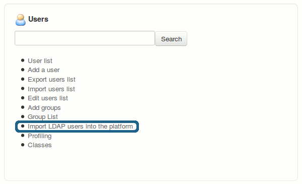

## LDAP {#ldap}

The LDAP authentication system in Chamilo has been submitted to various deep changes over time, and the current situation is somewhat confusing and always require some kind of manual update.

A patch by Eric Marguin in version 1.10.0 has fixed a series of issues related to import scripts not using the configuration file for LDAP (main/inc/conf/auth.conf.php).

### Configuring LDAP {#configuring-ldap}

To configure LDAP, check the LDAP variables in main/inc/conf/auth.conf.php.

By default, it will come like this (more or less), where elements to be adapted to your own LDAP server and configuration have been coloured in red :

/** * LDAP */ /** * Array of connection parameters **/ $extldap_config = array( //base dommain string &#039;base_dn&#039; =&gt; &#039;DC=cblue,DC=be&#039;, //admin distinguished name &#039;admin_dn&#039; =&gt; &#039;CN=admin,dc=cblue,dc=be&#039;, //admin password &#039;admin_password&#039; =&gt; &#039;pass&#039;, //ldap host &#039;host&#039; =&gt; array(&#039;1.2.3.4&#039;, &#039;2.3.4.5&#039;, &#039;3.4.5.6&#039;), // filter // &#039;filter&#039; =&gt; &#039;&#039;, // no () arround the string //&#039;port&#039; =&gt; , default on 389 //protocl version (2 or 3) &#039;protocol_version&#039; =&gt; 3, // set this to 0 to connect to AD server &#039;referrals&#039; =&gt; 0, //String used to search the user in ldap. %username will ber replaced // by the username. //See extldap_get_user_search_string() function below // &#039;user_search&#039; =&gt; &#039;sAMAccountName=%username%&#039;, // no () arround the string &#039;user_search&#039; =&gt; &#039;uid=%username%&#039;, // no () arround the string //encoding used in ldap (most common are UTF-8 and ISO-8859-1 &#039;encoding&#039; =&gt; &#039;UTF-8&#039;, //Set to true if user info have to be update at each login &#039;update_userinfo&#039; =&gt; true );/** * Correspondance array between chamilo user info and ldap user info * This array is of this form : * &#039;**Illegal HTML tag removed :** =&gt;<ldap_field>

*

* If <ldap_field>is &quot;func&quot;, then the value of <chamilo_field>will be

* the return value of the function

* extldap_get_<chamilo_field>($ldap_array)

* In this cas you will have to declare the extldap_get_<chamilo_field>

* function

*

* If <ldap_field>is a string beginning with &quot;!&quot;, then the value will be

* this string without &quot;!&quot;

*

* If <ldap_field>is any other string then the value of<chamilo_field>

* will be

* $ldap_array[<ldap_field>][0]

*

* If <ldap_field>is an array then its value will be an array of values

* with the same rules as above

**/

$extldap_user_correspondance = array(

&#039;firstname&#039; =&gt; &#039;givenName&#039;,

&#039;lastname&#039; =&gt; &#039;sn&#039;,

&#039;status&#039; =&gt; &#039;func&#039;,

&#039;admin&#039; =&gt; &#039;func&#039;,

&#039;email&#039; =&gt; &#039;mail&#039;,

&#039;auth_source&#039; =&gt; &#039;!extldap&#039;,

//&#039;username&#039; =&gt; ,

&#039;language&#039; =&gt; &#039;!english&#039;,

&#039;password&#039; =&gt; &#039;!PLACEHOLDER&#039;,

&#039;extra&#039; =&gt; array(

&#039;title&#039; =&gt; &#039;title&#039;,

&#039;globalid&#039; =&gt; &#039;employeeID&#039;,

&#039;department&#039; =&gt; &#039;department&#039;,

&#039;country&#039; =&gt; &#039;co&#039;,

&#039;bu&#039; =&gt; &#039;Company&#039;

)

);</ldap_field></ldap_field></chamilo_field></ldap_field></ldap_field></chamilo_field></chamilo_field></chamilo_field></ldap_field></ldap_field>

Once you&#039;ve got that file setup, you&#039;ll have to change configuration.php before a few things are added to your administration interface.

If you look at app/config/configuration.php and search for « ldap », you&#039;ll find these 3 lines :

// -&gt; Uncomment the two lines bellow to activate LDAP AND edit main/auth/external_login/ldap.conf.php for configuration // $extAuthSource[&quot;extldap&quot;][&quot;login&quot;] = $_configuration[&#039;root_sys&#039;]. $_configuration[&#039;code_append&#039;].&quot;auth/external_login/login.ldap.php&quot;; // $extAuthSource[&quot;extldap&quot;][&quot;newUser&quot;] = $_configuration[&#039;root_sys&#039;].$_configuration[&#039;code_append&#039;].&quot;auth/external_login/newUser.ldap.php&quot;;

Uncomment them to enable a few additional scripts.

When uncommenting, you&#039;ll see the following item appear in the administration panel.

This will give you access to a search list for users on the LDAP server, and options to import those users. Versions 1.9.x of Chamilo LMS, however, might have had a little issue with that, making it actually impossible to search from this screen.

To fix that, you should go and edit the ldap_get_users functions in main/auth/external_login/ldap.inc.php. There, you&#039;ll see that no matter what mapping you gave in the _$extldap_user_correspondance_variable in auth.conf.php, it isn&#039;t taken into account. Update that to get the search working.

Note that this should be fixed in Chamilo LMS 1.10.x.

### Running synchronisations {#running-synchronisations}

Some synchronization mechanisms are made to be run automatically (through CRON). To find these, look deeper into the main/auth/external_login/ folder.

The _ldap_import_all_users.php_ script, for example, can be executed to automatically insert all users from LDAP (following specific criterias defined in ldap.inc.php) into Chamilo. Please note that, once again, in version 1.9.x, this used to be slightly broken, requiring a review of the ldap.inc.php functions in order to work.