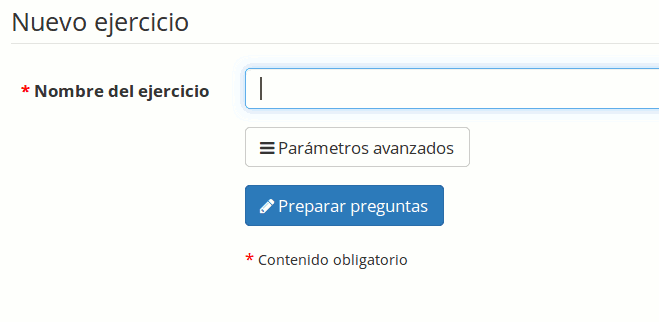
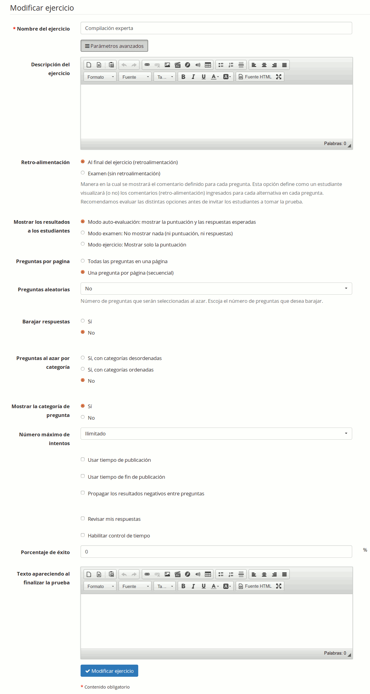

## Creando un nuevo ejercicio {#creando-un-nuevo-ejercicio}

Crear un nuevo ejercicio es muy fácil; para comenzar haz clic en el icono de _Nuevo ejercicio_  y da un nombre, a continuación haz clic en el botón _Preparar Preguntas_.

Ilustración 42: Ejercicios - Crear nuevo ejercicio

Si deseas escribir una descripción del ejercicio,puedes hacerlo haciendo clic en el botón de _Parámetros avanzados__,_ se mostrará un editor de texto en el que podrás escribir la descripción que quieras y se le mostrará a los alumnos cuando realicen el ejercicio.

Una vez que hayas creado el ejercicio, éste se mostrará en la página principal de la herramienta de _Ejercicios_ juntos con todos los ejercicios que se hayan creado.

Ilustración 43: Lista de ejercicios de un curso

Dado que hay varias formas de utilizar la herramienta de _Ejercicios_, puede darse el caso en que las opciones por defecto de los ejercicios no sean las que necesitas, si este llega a ser tu caso, puedes modificar las opciones por defecto en la sección de _Parámetros avanzados_ disponible al momento de crear o modificar un ejercicio, o usando el icono de herramientas ().

Ilustración 44: Parámetros avanzados de un ejercicio al momento de crearlo

Los parámetros avanzados se explican por si solo, sin embargo a continuación te mostramos una breve descripción de los mismos.

*   Retroalimentación, puede ser provista al final del ejercicio o no ofrecerla, por ejemplo en el caso de crear un examen.

*   Los resultados del ejercicio pueden se mostrados a los estudiantes (e.g. En un ejercicio interactivo) u ocultarlos (e.g. En un examen).

*   Preguntas por página, pueden ser mostradas todas en una sola página (e.g. En un examen rápido) o en páginas separadas (e.g. Cuando las preguntas y respuestas son extensas o cuando se incorporan elementos multimedia).

*   Las preguntas y respuestas pueden mostrarse en una secuencia predeterminada o de manera aleatoria y mezclada. En este caso, será necesario indicar cuantas de las preguntas disponibles se quiere ofrecer al alumno (así se puede tener una funcionalidad de banco de preguntas). Ya sea “Todas” o una cantidad inferior a la cantidad total de preguntas disponibles.

*   Tal como es posible barajar las preguntas, es posible barajar las respuestas dentro de una misma pregunta. En este caso, tendrás que evitar de usar respuestas como “Todas las anteriores”, ya que ¡esta respuesta podría aparecer primero en la lista!

*   Si decides clasificar las preguntas por categorías, podrás decidir también de seleccionar una cierta cantidad (fija) de preguntas por categoría. Lamentablemente, en Chamilo 1.10 todavía no es posible poner una cantidad variable de preguntas para cada categoría. Solo podrás, por ejemplo, decir que cada categoría muestra 5 preguntas al azar, pero no decir que la categoría A muestra 5 preguntas y la categoría B muestra 8 preguntas. Esperamos añadir esta funcionalidad a futuro.

*   Las categorías de las preguntas pueden ser mostradas u ocultadas en el ejercicio que se muestra al alumno.

*   El número de intentos para resolver el ejercicio puede limitarse a un número determinado o ser infinito, por ejemplo para ejercicios de práctica.

*   Es posible definir la fecha de inicio y de fin de disponibilidad de un ejercicio, así como también es posible definir el tiempo máximo que tiene un alumno para responder a las preguntas de un ejercicio, en cuyo caso se le mostrará un cronómetro con el tiempo que tiene disponible mientras realiza el ejercicio[^9]. Es importante notar que las fechas de disponibilidad **solo** afectan el inicio del ejercicio. Si la fecha de fin es a media noche y el alumno entra a las 23:59, podrá tomar todo su ejercicio con tranquilidad hasta terminar el tiempo impartido para el ejercicio.

*   Los resultados negativos, pueden ser contabilizados como _cero_ o acumulados para la siguiente pregunta.

*   Es posible definir si los estudiantes pueden revisar sus respuestas al finalizar el ejercicio.

*   Existe la opción de escribir un mensaje que se le mostrará a los estudiantes al finalizar el ejercicio.

*   Si se define un porcentaje de éxito, el estudiante verá un mensaje verde o rojo en la pantalla de resultados según su resultado final.

**Nota:** _El administrador de la plataforma puede habilitar una opción adicional para la sección de “Retroalimentación” de los parámetros avanzados: Autoevaluación (retroalimentación inmediata). Si se activa esta opción, se habilita el tipo de preguntas de “Escenario” que permite a los profesores crear preguntas de respuesta múltiple o de relacionar imágenes, que dependiendo de la respuesta del estudiante, le puede mostrar una secuencia alternativa de preguntas. Esta es una opción muy potente, sin embargo, ten cuidado, por que una vez que la opción de “Autoevaluación” se selecciona no es posible modificarla dentro de un ejercicio, si ya no la quieres utilizar, tendrás que crear un nuevo ejercicio sin que esta opción esté seleccionada._

[^9]: Si mientras un alumno resuelve u ejercicio éste se desconecta por cualquier motivo de la plataforma, el tiempo para resolver el ejercicio seguirá corriendo, sin embargo, el alumno podrá volver a conectarse y continuar el ejercicio justo en el punto donde lo dejó. El cronómetro solo se mostrará en los ejercicios configurados para mostrar todas las preguntas en una sola página.