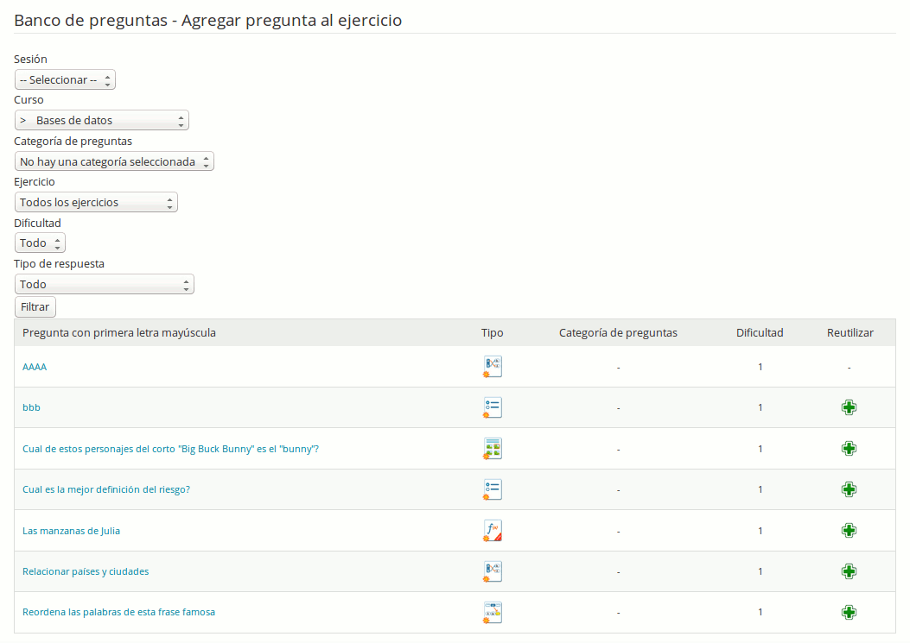

## Reutilizar preguntas existentes {#reutilizar-preguntas-existentes}

Cualquier pregunta creada, independientemente de la prueba o curso a la que se fue vinculada, se almacena en la base de datos de preguntas. Este almacén de preguntas puede ser muy útil para los profesores que quieren reutilizar preguntas que son muy generales o, si necesitas preguntas para servir como &quot;relleno&quot; cuando estás falto de un par de preguntas en una nueva prueba..

Durante la creación de la prueba, la base de datos muestra las preguntas de otros exámenes, así como preguntas huérfanas (es decir, las cuestiones que han pertenecido a una prueba que haya sido eliminada).

Cuando la base de datos de preguntas se muestra, presenta una lista con todas las preguntas existentes dentro del curso. Aquí es donde la asignación de las preguntas a las categorías y la adición de una dificultad para las pruebas puede resultar muy útil para identificar las preguntas individuales: utiliza las listas desplegables de _Filtro_ y _Dificultad_ para filtrar las preguntas adecuadamente.

Para acceder a la base de datos, haz clic en el icono de _reciclar preguntas existentes_ __tal y como aparece en la página _Crear una pregunta_ junto con los distintos tipos de preguntas:

Ilustración 69: Tests – Base de datos de preguntas

Haz clic en el botón de _Reutilizar en la prueba actual_ __para incluir la pregunta en la prueba actual. Lo que en realidad ocurre (en Chamilo 1.9) es que una copia de la prueba antigua se incluye en la prueba actual, de modo que puede ser editada en la nueva prueba si es necesario sin que su contenido o configuración se vean alterados en la prueba en la que fue originalmente creada.
