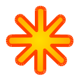

## Elementos comunes de la interfaz {#elementos-comunes-de-la-interfaz}

Puesto que sabemos que las convenciones facilitan las cosas para todos a la hora de recordar y gestionar, utilizamos un conjunto de símbolos visuales en todo Chamilo. Estos símbolos pueden aparecer solos representando una acción, o unidos a otro símbolo para representar el objeto de la acción.

A continuación se relacionan algunos de los símbolos más comúnmente utilizados en la plataforma:

| Iconos | Descripción |
| --- | --- |
|  | La herramienta lápiz permite la **edición** de una parte específica de información o contenido |
|  | El aspa permite **eliminar** una parte específica de información o contenido |
|  | El icono del ojo permite cambiar la **visibilidad** de una parte de información o contenido |
|  | La **estrella amarilla** dentro de un icono simboliza la creación de un nuevo recurso |
|  | Una flecha azul hacia la derecha generalmente indica **mover cosas** o **insertar cosas** en otras |
|  | Una flecha azul hacia la izquierda generalmente significa **volver** atrás (como el botón de retroceso en tu navegador). |
|  | Una flecha azul hacia abajo generalmente indica **descargar** algún archivo o datos. |
|  | Una flecha azul hacia arriba generalmente significa **subir** algún archivo o datos. |