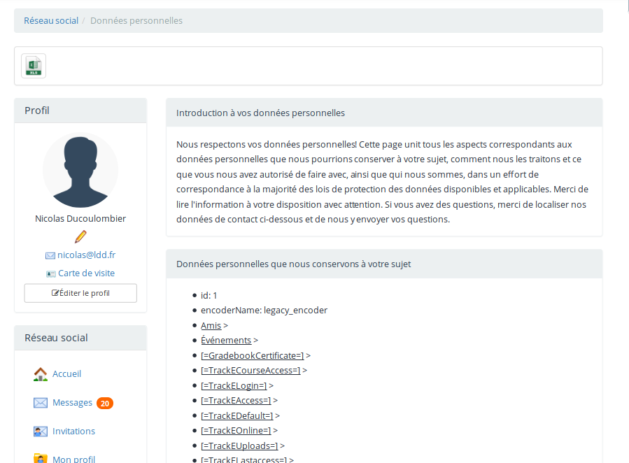
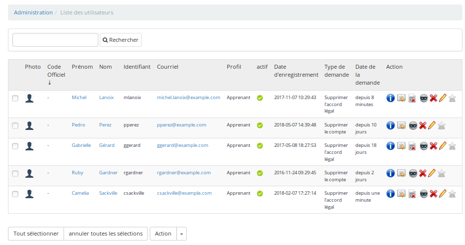

### Activation et configuration globale

Afin d'être en règle avec le règlement no 2016/679, dit Règlement Général sur la Protection des Données (RGPD, ou encore GDPR en anglais),
à partir de la version 1.11.8 les fonctionnalités ont été rajoutées et sont activées par défaut.
Il est possible de les désactiver dans le fichier de configuration app/config/configuration.php en ajoutant la configuration suivante :
```
$_configuration['enable_gdpr'] = false;
```
On peut également définir dans ce fichier le nom de la personne responsable du traitement des données (DPO), son email et son rôle exacte.
```
$_configuration['data_protection_officer_name'] = '';
$_configuration['data_protection_officer_role'] = '';
$_configuration['data_protection_officer_email'] = '';
```

La première conséquence de l'activation de ces fonctionnalités est l'apparition sur la page du réseau social d'une nouvelle entrée "Données Personnelles" sur la gauche de la page dans le bloc "Réseau social".

Administration - Lien Données Personnelles

Sur cette page chaque utilisateur pourra retrouver l'ensemble des informations personnelles qui sont stockées dans Chamilo et pourra les exporter au format Json.
Administration - Début Page Données Personnelles

Ensuite en bas de cette même page l'utilisateur pourra voir les informations concernant le DPO, les termes et conditions qu'il a acceptées, demander le retrait de son acceptation des celles-ci et donc son accord avec le traitement des données et également demander la suppression de son compte utilisateur.
Administration - Fin de la Page Données Personnelles

Ces 2 boutons de demandes envoient une information au DPO (si celui-ci n'est pas défini alors l'envoi est fait à tous les administrateurs) indiquant qu'une nouvelle demande est à traiter et un lien vers la page de gestion des demandes.

### Gestion des demandes

Les demandes de suppression de compte ou du retrait d'acceptation des termes et condition sont stockées et présentées sur la page de gestion de la liste des demandes utilisateurs /main/admin/user_list_consent.php  accessible depuis la page d'administration dans le bloc "Protection des données personnelles".
Administration - Bloc de Protection des Données Personnelles

La page présente une liste des utilisateur en indiquant le type de demande (suppression de compte ou suppression d'accord légal), le temps passé depuis la demande (sachant que le RGPD indique qu'il faut qu'une demande de suppression de compte soit traité dans un délais de 4 semaines, voir la configuration du Cron ci-dessous afin d'assurer le traitement dans les temps) et permet de traiter la demande avec différentes actions disponibles.
Administration - Liste des utilisateurs avec une demande en attente

Les actions disponibles sont identifiées par les icônes suivants :

| Icônes | Fonctionnalités |
| --- | --- |
|  | Permet d'afficher la page des informations génériques sur l'utilisateur |
|  | Permet d'ouvrir l'éditeur d'envoi de message interne avec l'utilisateur comme destinataire pré-rempli |
|  | Supprime l'acceptation des termes et conditions pour l'utilisateur : les données de l'utilisateur ne sont pas supprimées, s'il se connecte à la plateforme il lui sera demandé d'accepter les termes et conditions à nouveau afin d'avoir accés |
|  | Permet d'anonymiser le compte, c'est à dire que les infos sont conservées pour l'usage dans les statistiques, mais les données personnelles du compte de l'utilisateur n'y sont plus associés, donc l'utilisateur perd dans ce cas l'ensemble de ses données (certificat, compétences, résultat d'exercice, résultat de travaux, dates de connexions...) |
|  | Supprimer le compte utilisateur : Attention dans ce cas le compte ainsi que tous les résultats associés sont supprimés, donc l'utilisateur perd ses certificats, ses compétences et OpenBadges, ces validations de cours ou sessions, ses inscriptions, ses résultats d'exercice ou examens, c'est à dire que toutes les données sont supprimés l'utilisateur n'y a plus accès et elles ne sont plus disponible dans les statistiques non plus. |
|  | Éditer l'utilisateur : permet d'arriver au formulaire d'édition standard ou l'on peut voir en particulier les raisons de la demande de suppression des termes et conditions et les raisons de la demandes de suppression de compte (Les champs de texte obligatoires que l'utilisateur rempli quand il fait une de ces 2 demandes). |
|  /  | Permet de savoir si l'utilisateur est administrateur de la plateforme ou non |

### Configuration du Cron de rappel par mail de demandes en attente

Afin d'assurer que les demandes de suppression de compte sont traitées dans le délais maximum défini par le RGPD (4 semaines) il est possible de configurer une tâche Cron qui va vérifier s'il y a les demandes en attentes depuis plus de 7 jours et si c'est le cas alors pour chacune il est envoyé un rappel au DPO s'il est défini sinon à défaut à tous les administrateurs en indiquant le nom de la personne dont la demande est en attente et un lien vers la page de gestion des demandes en attente.

Cette fonctionnalité nécessite la configuration sur le serveur d'un processus _cron_ qui appelle le script suivant :
```
/main/cron/request_removal_reminder.php 
```

### Extension des termes et conditions

Une autre conséquence de l'activation des fonctionnalités pour répondre au RGPD est l'ajout de champs extra pour les termes et conditions afin de faciliter la description des parties obligatoires définies par le RGPD.
Sur la page d'édition des termes et conditions (voir la documentation spécifique sur l'activation et l'utilisation des termes et conditions) on trouve maintenant en plus du bloc d'édition principales un bloc d'édition par sous partie afin de ne rien oublier.

Les sous blocs sont :
* Collecte des données personnelles 
* Enregistrement des données personnelles 
* Organisation des données personnelles 
* Structuration des données personnelles 
* Conservation des données personnelles 
* Adaptation ou modification des données personnelles
* Extraction des données personnelles
* Consultation des données personnelles
* Utilisation des données personnelles 
* Communication et diffusion des données personnelles
* Interconnexion des données personnelles
* Limitation des données personnelles
* Effacement des donnée personnelles
* Destruction des donnée personnelles 
* Profilage des donnée personnelles 

Chacun de ces blocs apparaîtra comme une section des termes et conditions générales.
