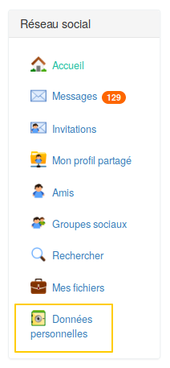
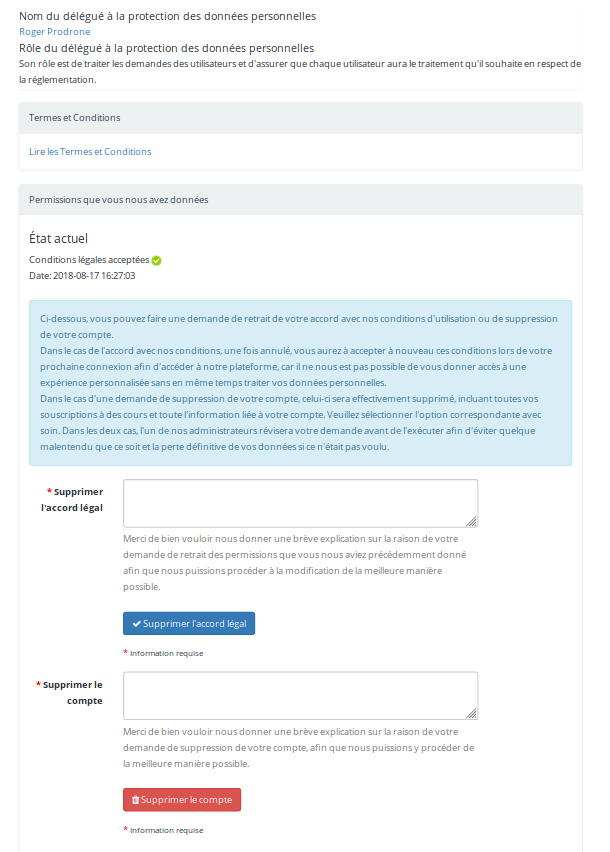

### Activation et configuration globale

Afin d'être en règle avec le règlement no 2016/679, dit Règlement Général sur la Protection des Données (RGPD, ou encore GDPR en anglais),
à partir de la version 1.11.8 les fonctionnalités ont été rajoutées et sont activées par défaut.
Il est possible de les désactiver dans le fichier de configuration app/config/configuration.php en ajoutant la configuration suivante :
```
$_configuration['enable_gdpr'] = false;
```
On peut également définir dans ce fichier le nom de la personne responsable du traitement des données (DPO), son email et son rôle exacte.
```
$_configuration['data_protection_officer_name'] = '';
$_configuration['data_protection_officer_role'] = '';
$_configuration['data_protection_officer_email'] = '';
```

La première conséquence de l'activation de ces fonctionnalités et l'apparition sur la page du réseau social d'une nouvelle entrée "Données Personnelles" sur la gauche de la page dans le bloc "Réseau social".
Administration - Lien Données Personnelles

Sur cette page chaque utilisateur pourra retrouver l'ensemble des informations personnelles qui sont stockées dans Chamilo et pourra les exporter au format Json.
Administration - Début Page Données Personnelles

Ensuite en bas de cette même page l'utilisateur pourra voir les informations concernant le DPO, les termes et conditions qu'il a acceptées, demander le retrait de son acceptation des celles-ci et donc son accord avec le traitement des données et également demander la suppression de son compte utilisateur.
Administration - Fin de la Page Données Personnelles

Ces 2 boutons de demandes envoient une information au DPO (si celui-ci n'est pas défini à tous les administrateurs) indiquant qu'une nouvelle demande est à traiter et un lien vers la page de gestion des demandes.

### Gestion des demandes

Les demandes de suppression de compte ou du retrait d'acceptation des termes et condition sont stockées et présentées sur la page de gestion de la liste des demandes utilisateurs /main/admin/user_list_consent.php  accessible depuis la page d'administration dans le bloc "Protection des données personnelles".
Administration - Bloc de Protection des Données Personnelles

