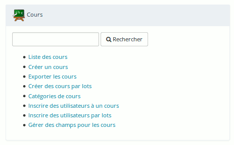
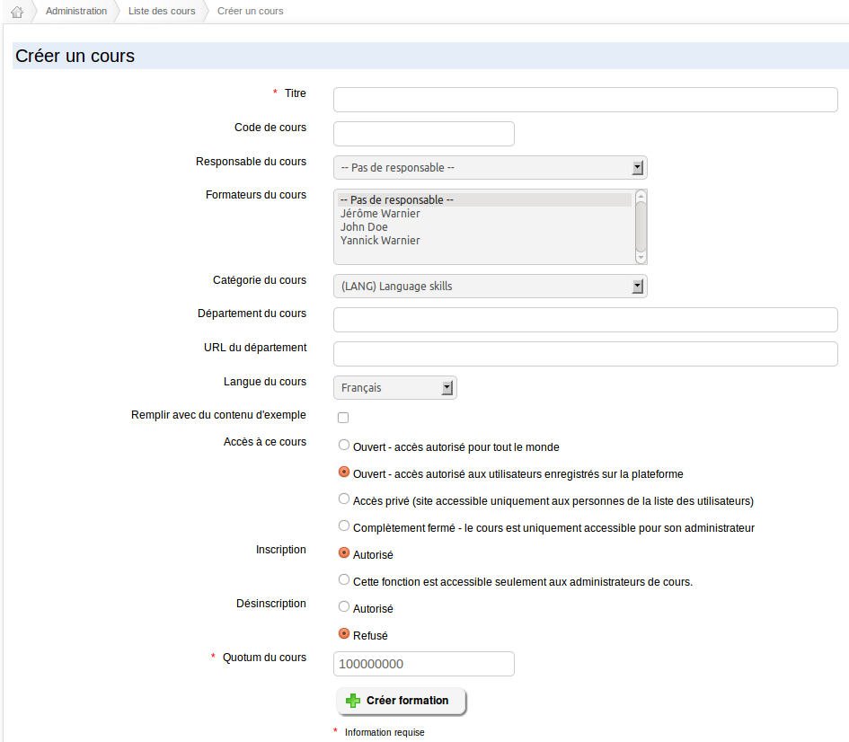
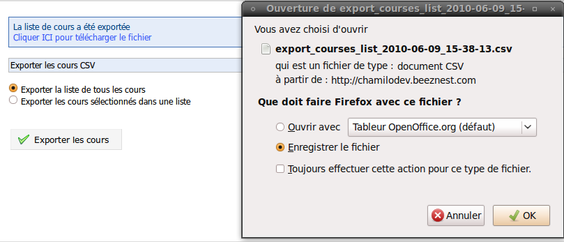
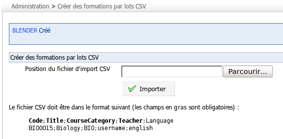
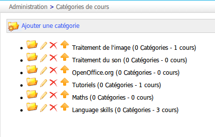

## L&#039;administration des « Cours » {#l-administration-des-cours}

Les cours sont des **espaces** au sein desquels les enseignants génèrent du contenu en utilisant la vingtaine d&#039;outils mis à leur disposition pour enseigner d&#039;une façon mémorable, dynamique, multimédia et, dans la mesure du possible, ludique.

Illustration 56: Bloc d&#039;administration des cours

Les cours peuvent être agrémentés d&#039;une notion temporelle grâce à l&#039;utilisation de **sessions** (voir 4.4Administrer les « Sessions de formation » en page 72).

La gestion des cours se fait avec des icônes déjà connues pour la plupart :

| Icônes | Fonctionnalités |
| --- | --- |
|  | Donne toutes les informations sur l&#039;utilisation du cours et des utilisateurs |
|  | Donne le suivi détaillé des apprenants, du cours, et un rapport des ressources |
|  | Modifier les paramètres/informations d&#039;un cours |
|  | Supprimer (après demande de confirmation) un cours |
|  | Générer ou importer une sauvegarde |
|  | Visualiser le sommaire du cours |

Tableau 3: Administration - Icônes de gestion des cours

### Liste des cours {#liste-des-cours}

Cet outil permet de visualiser tous les cours que contient la plateforme.

Illustration 57: Administration - Liste des cours

Cette liste nous donne une grande quantité d&#039;informations sur les cours. Notez la couleur des cercles préfixant les titres de cours : elles représentent la visibilité des cours en question :

*   bleu : public

*   vert : ouvert aux utilisateurs de la plateforme

*   orange : privé, utilisateurs inscrits par des enseignants ou administrateurs

*   rouge : fermé (pour maintenance ou expiration, généralement), le cours n&#039;est disponible que pour les enseignants du cours et les administrateurs

Elle nous permet également de modifier des informations en un clic sur une icône dans la partie droite « Action ».

#### Modifier les informations du cours {#modifier-les-informations-du-cours}

Pour modifier le cours, il faut cliquer sur le « crayon » à droite. En tant qu&#039;administrateur, il est possible de changer autant d&#039;informations que l&#039;enseignant créateur du cours dans les paramètres du cours.

Par contre, l&#039;administrateur peut également mettre le cours en « Cours spécial », ce qui à pour effet de le rendre visible à tous les utilisateurs de la plateforme. Il peut aussi changer l&#039;enseignant du cours et augmenter la taille disponible pour le cours.

#### Le suivi et la sauvegarde {#le-suivi-et-la-sauvegarde}

Le suivi est le même menu pour l&#039;administrateur que pour l’enseignant d&#039;un cours dont il est responsable (cf _tutoriel formateur_). Idem pour la sauvegarde.

Ces icônes ne sont que des raccourcis qui renvoient l&#039;administrateur vers l&#039;onglet « Mes cours ».

### Créer un cours {#cr-er-un-cours}

En tant qu&#039;administrateur, lors de la création d&#039;un cours, seul le titre est obligatoire.

Illustration 58: Création de cours

Outre ces champs obligatoires, en plus d&#039;un enseignant, il est possible :

*   d&#039;assigner un responsable principal du cours,

*   d&#039;ajouter un ou plusieurs enseignants au cours,

*   de donner un « Département du cours » et une « URL du département »,

*   de gérer son accès directement,

*   de gérer l&#039;inscription et la désinscription.

Quelques paramètres se sont encore ajoutés à ceux-ci dans la version 1.10\. Ils ont pour objectif d&#039;étendre les possibilités du catalogue de cours de Chamilo.

Illustration 59: Champs de cours additionnels à partir de la 1.10

On y retrouve donc les deux champs suivants :

*   tags

*   URL de vidéo

Ces champs ne seront utiles **que** dans un cas d&#039;utilisation du catalogue de sessions. Dans ce cas, et si l&#039;on a veillé à inclure ce cours dans une session, on retrouvera un écran de présentation de session similaire au suivant :

Illustration 60: Écran de présentation de session

On y retrouve donc bien une pré-visualisation de la vidéo liée au cours, ainsi que les tags en bas à droite. On y trouve également des liens vers quelques réseaux sociaux, afin de faciliter la promotion de cette session. Nous reparlerons des sessions dans le chapitre suivant.

### Exporter les cours {#exporter-les-cours}

Cette fonction permet d&#039;exporter tout ou partie de la liste des cours au format CSV.

Illustration 61: Administration - Export de cours

### Créer des cours par lot {#cr-er-des-cours-par-lot}

Cette fonction permet d&#039;importer le fichier CSV exporté précédemment dans « Exporter les cours ». Attention, il faut avoir les mêmes catégories si l&#039;export se fait dans une autre plateforme Chamilo (le nom et le code de la catégorie).

Illustration 62: Administration - Création de cours par lots

Une fois la liste importée, reste à ajouter les parcours au cours.

### Catégories de cours {#cat-gories-de-cours}

Ici, on peut créer, modifier ou supprimer les différentes catégories de cours souhaitées avec les icônes que nous avons déjà vues. Il est possible de créer de nombreuses catégories et sous-catégories.

Illustration 63: Administration - Catégories de cours

Il est aussi possible d&#039;organiser ces catégories grâce aux flèches. Ces catégories ne sont pas traduites automatiquement et il n&#039;est pas possible d&#039;enregistrer des traductions pour chaque catégorie et chaque langue, ce qui veut dire que si vous disposez d&#039;un portail multilingue, vous devrez trouver une formulation suffisamment claire pour que tous vos utilisateurs la comprennent.

### Inscrire des utilisateurs à un cours {#inscrire-des-utilisateurs-un-cours}

L&#039;administrateur peut inscrire n&#039;importe qui à n&#039;importe quel cours :

*   sélectionner une ou plusieurs personnes (à l&#039;aide des touches CTRL ou MAJuscule),

*   choisir le(s) cours au(x)quel(s) les inscrire,

*   cliquez « inscrire à ce(s) cours ».

Illustration 64: Administration - Inscription d&#039;utilisateurs à un cours

### Inscrire des utilisateurs par lot {#inscrire-des-utilisateurs-par-lot}

Cette fonction permet à l&#039;administrateur, après avoir fait un export d&#039;utilisateurs pour un cours, de les importer grâce à un fichier CSV ou XML.

Illustration 65: Administration - Inscription d&#039;utilisateurs à un cours, par lots

Cet import permet d&#039;effectuer deux actions qu&#039;il suffit de cocher pour qu&#039;elles soient prises en compte et que vous puissiez gérer la liste d&#039;utilisateurs en fonction de l&#039;import.

### Gérer les champs pour les cours {#g-rer-les-champs-pour-les-cours}

Cette fonctionnalité est similaire à la gestion des champs de profil des apprenants. Bien que les champs additionnels de cours n&#039;aient pas d&#039;utilité immédiate dans une installation Chamilo de base, ils représentent un atout très puissant pour l&#039;implémentation de nouveaux plugins ou l&#039;utilisation de plugins existants qui étendent les fonctionnalités de cours.