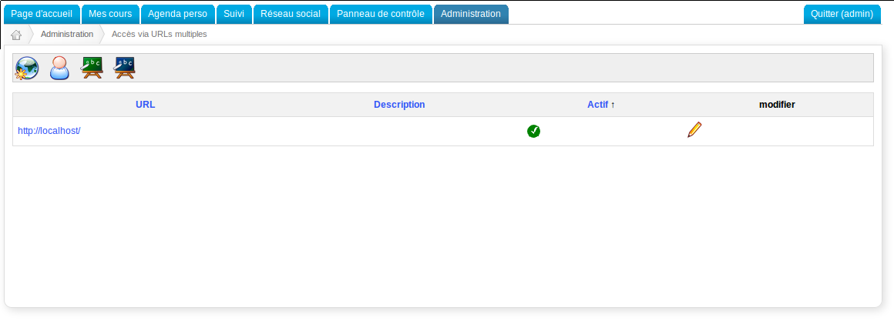

## Multi-URL {#multi-url}

Chamilo offre une fonctionnalité discrète mais pratique dans le cas de l&#039;utilisation du portail pour plusieurs catégories d&#039;utilisateurs, pour lesquels il faut considérer la disponibilité du portail sur un nom de domaine distinct, avec un style visuel distinct et une pré-sélection de seulement certains cours et certains utilisateurs.

### Cas pratique universitaire {#cas-pratique-universitaire}

Imaginez que les 12 facultés de votre université veuillent montrer leur portail sous une apparence distincte (chacune veut sa variation de logo dans l&#039;en-tête et une couleur de fond légèrement différente). De plus, chacune d&#039;entre elles dispose de ses propres enseignants, qui « parfois » donnent cours dans plus d&#039;une faculté. Les étudiants également sont des étudiants uniquement de cette faculté (sauf exceptions). Enfin, les cours sont différents, sauf dans certains cas particuliers pour des cours très génériques.

### Cas pratique corporatif {#cas-pratique-corporatif}

Imaginez que votre entreprise propose des cours de sécurité du travail à plusieurs clients. Imaginez maintenant que l&#039;un de ces clients soit _Coca-Cola_, et que l&#039;autre soit _Pepsi_. Évidemment, vous voulez éviter que ces deux clients se rendent compte que vous utilisez le même portail pour leur enseigner la sécurité du travail. Évidemment aussi, vous voudriez réutiliser le même cours, mais sans que les apprenants ne voient les contributions des apprenants de l&#039;autre entreprise.

### La solution {#la-solution}

Nous appelons cette solution le multi-URL. En activant le multi-URL, vous activez en réalité le mécanisme suivant :

*   vous utilisez la même base de code

*   vous utilisez la même base de données

*   un portail « maître » (qui n&#039;est pas utilisé directement par vos clients) permet de définir les portails « esclaves »

*   chaque cours est créé dans un portail « esclave » et n&#039;est visible que dans ce portail esclave

*   chaque utilisateur est créé dans un portail esclave, et n&#039;est visible que dans ce portail esclave et n&#039;a accès qu&#039;à ce portail

*   chaque portail esclave utilise un nom de domaine (ou de sous-domaine) différent

*   chaque portail peut utiliser son propre style graphique

*   un (ou plusieurs) administrateur peut être assigné à chaque portail esclave. Cet administrateur n&#039;a pas accès aux paramètres de configuration globaux ni aux utilisateurs des autres portails

*   une session peut utiliser un cours global, mais chaque session n&#039;existe jamais que dans un et un seul portail

L&#039;utilisation de la même base de données permet cependant certaines fonctionnalités « bonus ».

*   un cours peut être rendu « global » et accessible depuis d&#039;autres plates-formes (selon sélection) par l&#039;administrateur global

*   un utilisateur (apprenant, enseignant ou administrateur) peut se voir donner accès à d&#039;autres portails par l&#039;administrateur global

### Installer {#installer}

Pour configurer le mode multi-URL, vous aurez besoin

*   d&#039;un accès à la configuration de votre serveur Web

*   d&#039;un accès à la définition de vos noms de domaines

*   d&#039;un accès au fichier de configuration de Chamilo

La marche à suivre est :

*   de modifier app/conf/configuration.php et dé-commenter la ligne qui dit : _$_configuration[&#039;multiple_access_urls&#039;] = true;_

*   d&#039;ajouter des directives _SiteAlias_ dans votre VirtualHost d&#039;Apache HTTPd (rien de plus)

*   de définir les noms de domaines ou sous-domaines pour qu&#039;ils dirigent vers le même serveur

*   d&#039;aller dans votre page d&#039;administration de Chamilo et de suivre le lien « Configurer l&#039;accès via URLs différents (branding) »

*   de définir votre URL principal (renommer _localhost_)

*   d&#039;ajouter les sous-portails voulus et y activer un administrateur local pour chacun

Illustration 82: Administration - Multi-URLs