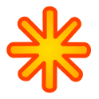
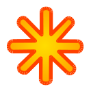
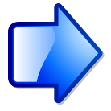
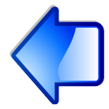
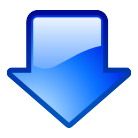

## Éléments communs de l&#039;interface {#l-ments-communs-de-l-interface}

L&#039;enseignant dispose des trois boutons génériques suivants sur la plate-forme :

| Icônes | Fonctionnalités |
| --- | --- |
|  | L&#039;outil « crayon » qui permet de **modifier** une information |
|  | L&#039;outil « croix » qui permet de **supprimer** des informations ou un contenu |
|  | L&#039;outil « œil » qui permet de rendre **visible** ou **invisible** une information |
|  | L&#039;étoile jaune par-dessus un icône symbolise la création d&#039;une nouvelle ressource |
|  | Une flèche bleue vers la droite indique généralement l&#039;action de déplacer les choses ou les insérer dans d&#039;autres |
|  | Une flèche bleue vers la gauche signifie généralement retourner en arrière (comme le bouton de retour en arrière de navigateur). |
|  | Une flèche bleue vers le bas indique généralement le téléchargement de fichiers ou de données. |
|  | Une flèche bleue vers le haut indique généralement l&#039;envoi de fichiers ou de données vers le serveur. |