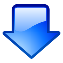
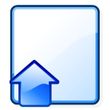

## Éléments communs de l'interface {#l-ments-communs-de-l-interface}

L'enseignant dispose des trois boutons génériques suivants sur la plateforme :

| Icônes | Fonctionnalités |
| --- | --- |
|  | L'outil « crayon » qui permet de **modifier** une information |
|  | L'outil « croix » qui permet de **supprimer** des informations ou un contenu |
|  | L'outil « œil » qui permet de rendre **visible** ou **invisible** une information |
|  | L'étoile jaune par-dessus un icône symbolise la création d'une nouvelle ressource |
|  | Une flèche bleue pointant vers la droite indique généralement l'action de déplacer les choses ou les insérer dans d'autres |
|  | Une flèche bleue pointant vers la gauche signifie généralement retourner en arrière \(comme le bouton de retour en arrière de navigateur\). |
|  | Une flèche bleue pointant vers le bas indique généralement le téléchargement de fichiers ou de données. |
|  | Une flèche bleue pointant vers le haut indique généralement l'envoi de fichiers ou de données vers le serveur. |

