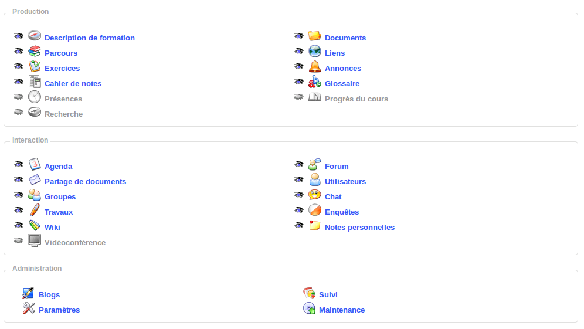

# Administrer un cours {#administrer-un-cours}

L&#039;onglet « Mes cours » permet de visualiser les cours qui sont administrables par l&#039;enseignant (ils affichent une icône de crayon pour l&#039;édition du côté droit de la boîte de chaque cours).

Il suffit de cliquer sur le cours pour accéder à son interface. Trois catégories d&#039;outils apparaissent :

*   Production : permet de générer le contenu du cours,

*   Interaction : regroupe des outils utiles à l&#039;utilisation du cours,

*   Administration : outils d&#039;administration du cours, comme le suivi ou la sauvegarde.

Illustration 19: Outils de cours - vue classique

L&#039;enseignant peut choisir de cacher ou de montrer différents outils grâce à l&#039;œil qui est devant chaque outil, et ce afin de ne pas surcharger un cours avec trop de possibilités.

Note : selon les cas, l&#039;administrateur peut rendre disponible/indisponible les outils aux enseignants ou peut activer/désactiver certains outils qui dépendent d&#039;extensions (comme les outils de recherche et de vidéo-conférence).

Illustration 20: Outils de production vue ipad

**Note** : L&#039;interface du cours peut se présenter de manière différente selon le choix de l&#039;administrateur. Par exemple, il pourra activer, à partir de la version 1.8.8, une apparence plus à la mode des dispositifs mobiles, comme dans cette illustration.