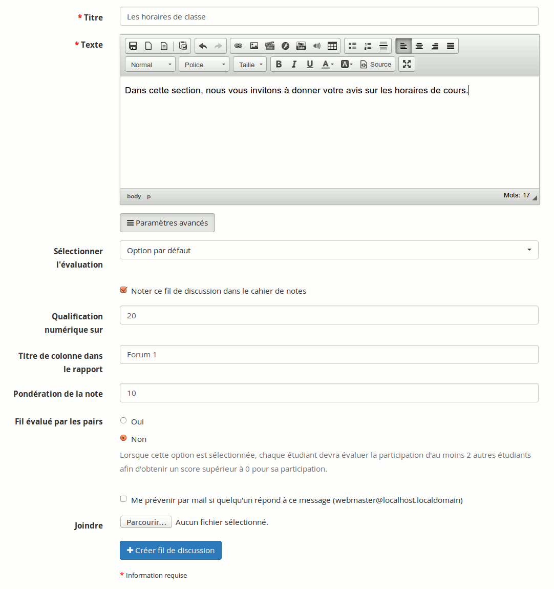

## Lancer un nouveau sujet {#lancer-un-nouveau-sujet}

Lorsque le contenu d&#039;un forum est affiché :

*   cliquer sur le lien « Nouveau sujet »,

*   compléter les champs « Nom » et « Texte »,

*   Les paramètres avancés permettent :

    *   1\. de rendre le fil de discussion évaluable par l&#039;enseignant et d’y affecter un score maximal. Pour cela, il faut :

        *   cocher la case « Noter ce fil de discussion dans le rapport de compétences »,

        *   affecter un score maximal qui reflète la participation idéale d’un apprenant au fil de discussion,

        *   saisir ou modifier l’intitulé de la colonne correspondante sur le rapport de compétences de l&#039;apprenant,

        *   pondérer (coefficient) la note de participation au fil de discussion par rapport aux autres composantes de l’évaluation.

Illustration 61: Forum - Fil de discussion

*   *   2\. d’être prévenu par courriel si une contribution est apportée au fil de discussion,

    *   3\. de positionner le message toujours en haut du fil de discussion,

    *   4\. d’ajouter un fichier joint à l&#039;article, éventuellement enrichi d’un commentaire,

    *   5\. de décider que ce sujet est évalué en mode « peer assessment » (évaluation par les pairs), ce qui permettra aux étudiants de se donner des notes entre eux (selon des règles préétablies dans Chamilo)

*   Cliquer sur « Créer fil de discussion »