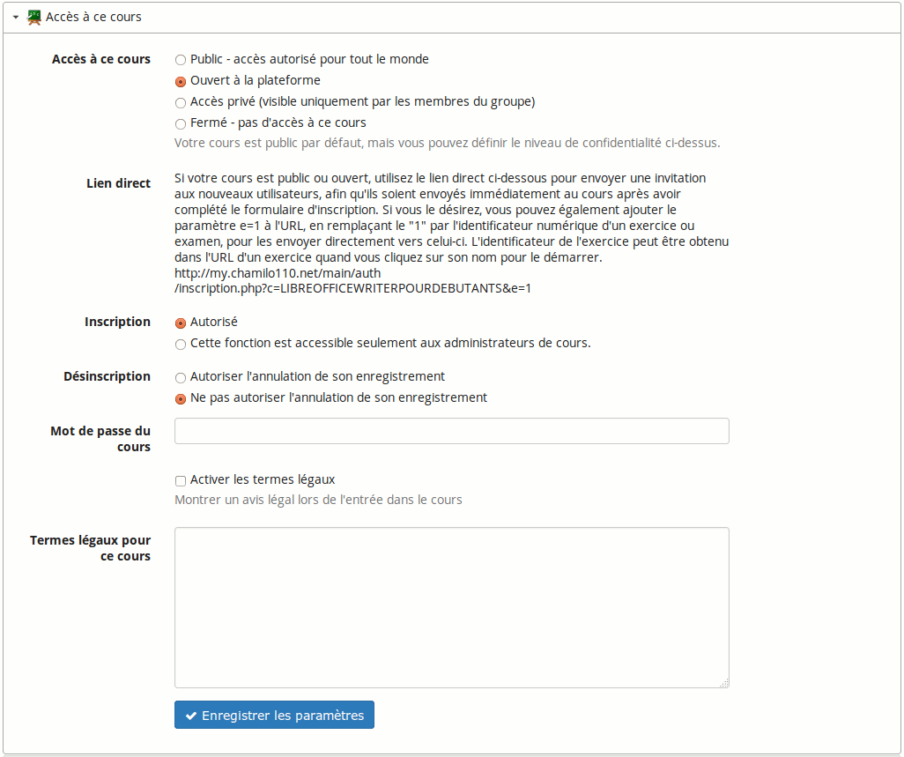

# Contrôler l&#039;accès à un cours {#contr-ler-l-acc-s-un-cours}

Lors de la création de parcours dans le cours, il est préférable de ne pas donner le droit d&#039;accès aux apprenants pour qu&#039;ils ne voient pas un cours inachevé ou non corrigé.

Pour cela, il faut limiter l&#039;accès au cours en allant dans les propriétés :

Illustration 14: Outils d&#039;administration du cours

Ensuite, plusieurs choix sont disponibles.

Illustration 15: Paramètres de cours - Accès

1.  **Public** : il s&#039;agit d&#039;un mode qui permet à tout utilisateur ayant accès au portail (sans même avoir besoin d&#039;un compte utilisateur) de consulter les ressources du cours. Cette option pourrait être appelée simplement _Tout public_.

2.  Ouvert à la plate-forme : cette option permet à tous les utilisateurs enregistrés sur la plate-forme d&#039;accéder au contenu du cours, au travers d&#039;une inscription à ce cours (que ce soit par invitation de l&#039;enseignant ou via une auto-inscription à partir du catalogue de cours). Il s&#039;agit de l&#039;option par défaut_._

3.  Accès privé : le cours n&#039;est disponible que sur inscription d&#039;un utilisateur de la plate-forme au cours par un enseignant de ce cours ou un administrateur.

4.  Fermé : le cours n&#039;est disponible que pour son enseignant et l&#039;administrateur. Les autres utilisateurs n&#039;ont pas le droit d&#039;y accéder. Cette dernière option est recommandée durant la période de construction du cours.