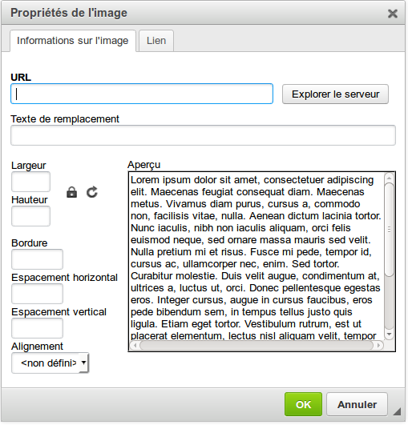
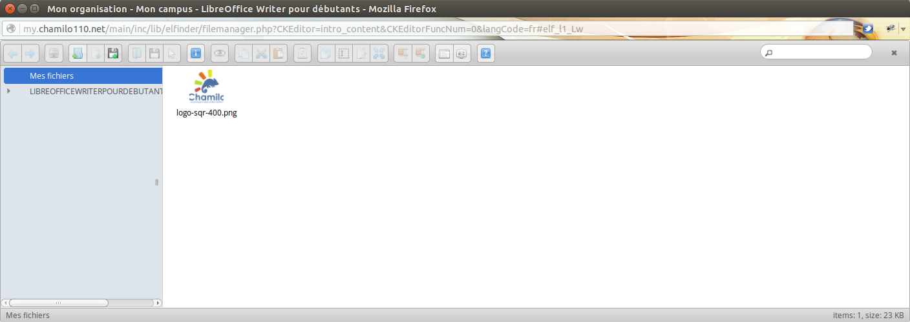
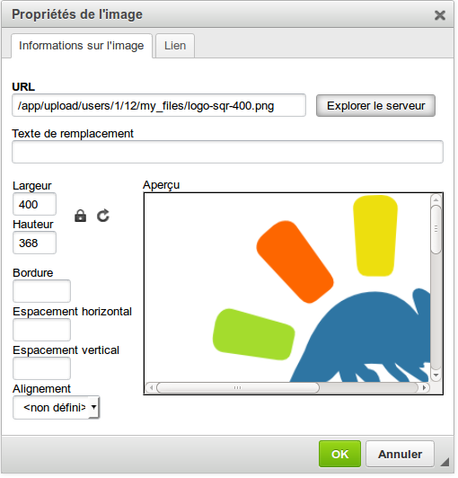

## Envoyer une image {#envoyer-une-image}

Avec le nouvel éditeur WYSIWYG (CKeditor), la procédure d&#039;envoi d&#039;une image est considérablement modifié par rapport aux versions antérieures. C&#039;est pourquoi nous préférons vous expliquer son fonctionnement, en quelques étapes.

*   Étape 1: ouvrir l&#039;éditeur WYSIWYG sur une page quelconque

*   Étape 2: cliquer sur l&#039;icône de paysage

*   Étape 3: dans la fenêtre pop-up, sélectionner le bouton “Explorer le serveur”

*   Étape 4: dans la nouvelle fenêtre, utiliser la 6ème icône qui représente une disquette avec un symbole “+” vert

*   Étape 5: sélectionner le fichier sur l&#039;ordinateur et cliquer sur “Ouvrir”

*   Étape 6: quand le fichier a été envoyé, double-cliquer sur le fichier qui s&#039;affiche à présent dans la fenêtre

*   Étape 7: dans la fenêtre pop-up initiale, une pré-visualisation de l&#039;image apparaît pour l&#039;utiliser au sein du contenu. Ajuster sa taille et son alignement. Une fois prêt/e, vous pouvez confirmer et l&#039;image apparaîtra insérée dans le document édité.

