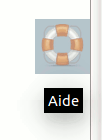
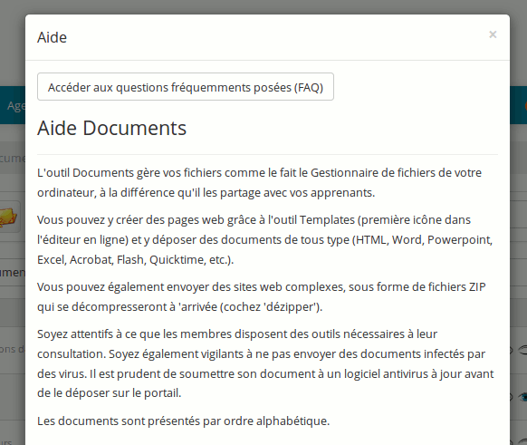
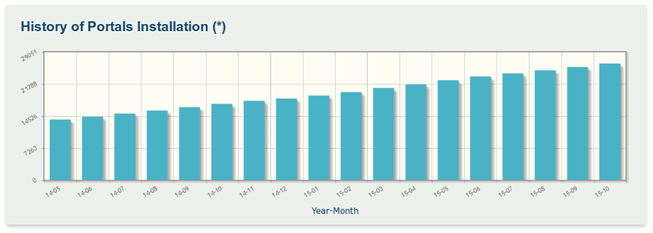

## Ergonomie générale {#ergonomie-g-n-rale}

Chamilo a été créé pour fournir de l&#039;aide au sein même de l&#039;application. Les icônes ont été concue pour symboliser ce qu&#039;elles représentent, indépendamment de la langue ou de la culture de l&#039;utilisateur. Enfin, chaque icône offre une brève description de son fonctionnement qui s&#039;affiche au moment de passer par-dessus avec le curseur de la souris (sans cliquer).

Il existe également un système d&#039;aide en ligne sur une majorité des pages qui apparaît sous forme d&#039;une bouée de sauvetage partiellement obfusquée dans la partie supérieure droite de l&#039;écran (voirIllustration 2: Aide cachée) et qui se déplie au moment de passer par dessus avec le curseur de la souris(voirIllustration 3: Aide dépliée). L&#039;aide se déplace selon la position de l&#039;écran et reste toujours disponible. Vous pouvez l&#039;ouvrir ou la fermer sans affecter votre travail du moment. Lorsque vous cliquez sur la bouée, un petit guide s&#039;ouvre dans une fenêtre flottante, expliquant l&#039;outil sur lequel vous êtes ainsi que la manière de l&#039;utiliser (voir Illustration 4: Fenêtre d&#039;aide contextuelle).

| Illustration 2: Aide cachée | Illustration 3: Aide dépliée |
| --- | --- |

Illustration 4: Fenêtre d&#039;aide contextuelle

### Terminologie {#terminologie}

Chamilo est utilisé par de dizaines de milliers d&#039;organisations dans le monde entier, en différentes langues, incluant des écoles d&#039;enseignement primaire, collèges, instituts, universitaires, ONG, institutions gouvernementales, petites, moyennes et grandes entreprises.

Illustration 5: Historique d&#039;installations de Chamilo dans le monde entre janvier 2010 et mai 2013

Il est clair qu&#039;elles tendent toutes à utiliser des terminologies différentes. Par exemple, quelques institutions appellent leurs cours “sessions de formation”. D&#039;autres les appellent “espaces d&#039;apprentissage”, d&#039;autres les appellent simplement “cours”. Ceci suppose un défi pour élaborer une plateforme de formation de “taille unique” (ou même un guide utilisateur). C&#039;est pourquoi nous avons recherché une solution intermédiaire et employé une terminologie simple et universelle que nous espérons avoir du sens pour tous nos utilisateurs. À l&#039;heure de terminer la révision de ce guide début 2016, plus de 29000 portails Chamilo ont déjà été installés dans le monde. Soit autant d&#039;organisations, petites et grandes, qui réunissent plus de 11 millions d&#039;utilisateurs dans le monde.

Historique des installations de Chamilo dans le monde, mai 2014 à octobre 2015

Nous comprenons bien entendu que votre organisation puisse préférer une terminologie spécifique. C&#039;est pourquoi nous avons équipé Chamilo d&#039;une fonctionnalité d&#039;édition des termes d&#039;interface depuis la section d&#039;administration de la plateforme (cela demande cependant des permissions d&#039;administrateur, c&#039;est pourquoi elle est décrite dans le Guide d&#039;administration de Chamilo). Si vous avez besoin d&#039;une personnalisation d&#039;urgence, vous pouvez toujours contacter les fournisseurs officiels de Chamilo[^1]pour l&#039;élaboration d&#039;un paquet de langues personnalisée pour l&#039;importer sur votre plateforme.

Dans ce guide, nous nous sommes efforcés à utiliser une terminologie universelle. Ainsi, par exemple, le terme « étudiant » employé communément a été remplacé par des termes plus neutres comme « apprenant » qui s&#039;appliquent aussi au monde professionnel. Quand on se réfère à tous les types d&#039;utilisateurs de manière collective, on utilisera le terme « utilisateur ».

Ainsi, nous avons aussi décidé d&#039;utiliser le terme « enseignant » pour identifier les différents acteurs qui ont un rôle similaire mais pas identique : formateurs, tuteurs, professeurs, enseignants, etc (et leurs équivalents féminins, évidemment).

Ce manuel est disponible en différents formats. Vous pouvez le télécharger depuis notre site web en un format non-éditable. Pour un format éditable, envoyez-nous un petit e-mailàinfo@chamilo.org. Si vous l&#039;améliorez, nous nous ferons un plaisir d&#039;intégrer vos changements au manuel de base.

L&#039;unité de regroupement minimale des outils s&#039;appelle un « cours ». Le terme « parcours d&#039;apprentissage » utilisé dans les versions précédentes du logiciel a été réduit au terme « parcours » pour éviter des problèmes d&#039;affichage.

Enfin, vous trouverez tous ces termes définis et expliqués dans ce guide. Si vous avez un doute, révisez leGlossaire en page196. N&#039;oubliez pas que vous pouvez personnaliser ces termes avec l&#039;aide de votre administrateur et de l&#039;outil de sous-langages.

[^1]: https://chamilo.org/providers
