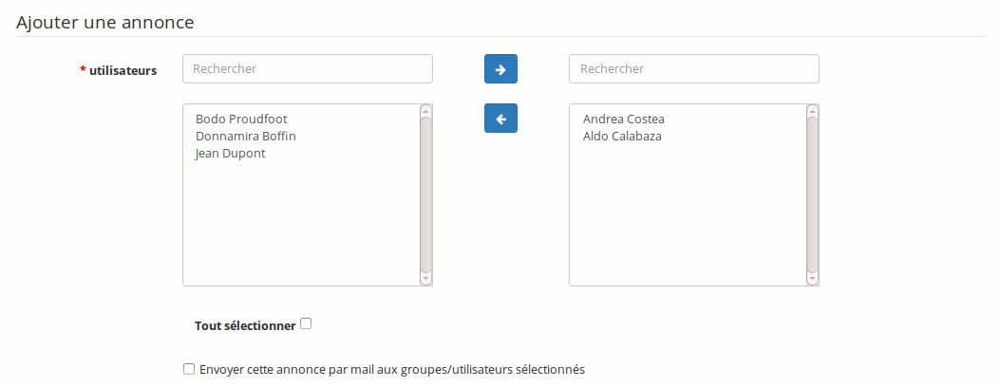
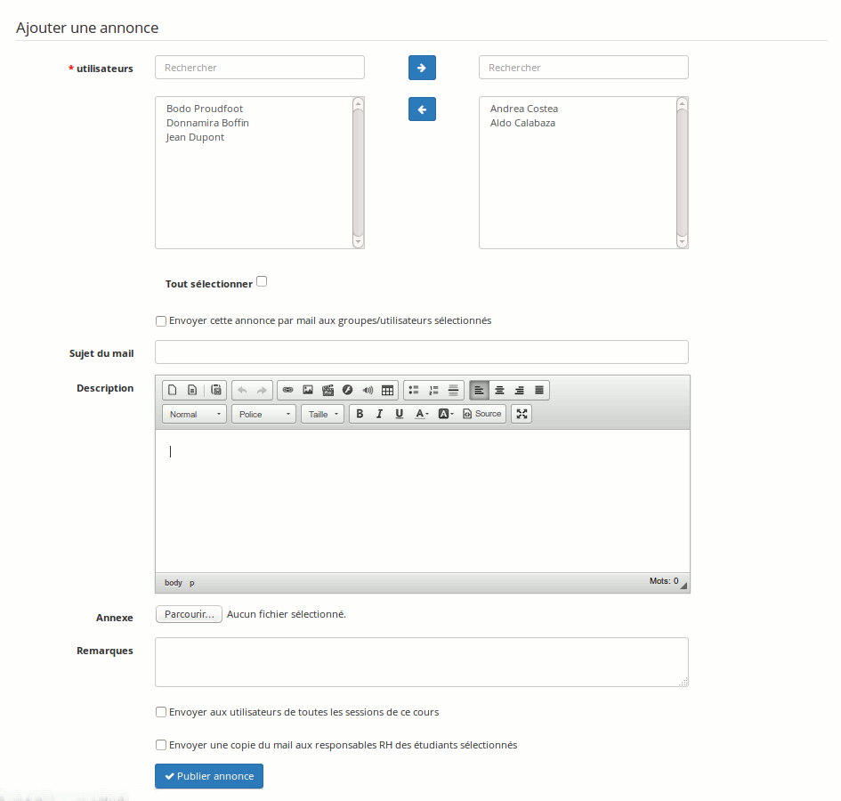

## Ajouter une annonce {#ajouter-une-annonce}

Une fois dans l&#039;outil :

*   cliquez sur « Ajouter une annonce »,

*   par défaut, l&#039;annonce sera diffusée à tous. Il est possible de gérer la liste de diffusion :

Illustration 134: Annonces - Choix des destinataires

*   l&#039;annonce peut être envoyée par courriel aux utilisateurs (cochez la case « Envoyer cette annonce par email »),

*   ajoutez un « Sujet » à l&#039;annonce,

*   donnez-lui une description,

*   il est aussi possible d&#039;ajouter une annexe, à partir de son ordinateur, et de lui donner une description si cela est nécessaire,

*   cliquez sur « Publier l&#039;annonce ».

Illustration 135: Annonces - Création

Bien que ces options n&#039;apparaissent pas (par erreur) dans certaines versions de Chamilo, l est possible d&#039;ajouter des marqueurs dans le texte des annonces, de telle sorte que celles-ci puissent être plus personnalisées ou plus rapides à rédiger.

Les marqueurs disponibles sont :

*   ((user_name)) : le nom d&#039;utilisateur (login)

*   ((user_firstname)) : le prénom

*   ((user_lastname)) : le nom de famille

*   ((teacher_name)) : le nom complet de l&#039;enseignant

*   ((teacher_email)) : l&#039;e-mail de l&#039;enseignant (utile pour permettre à vos apprenants de vous contacter)

*   ((course_title)) : le titre du cours

*   ((course_link)) : un lien vers la page d&#039;accueil du cours

*   ((official_code)) : le code officiel du cours (ce qui apparaît dans l&#039;URL)

Pour les utilisez, copiez-les simplement, tels quels (incluant les doubles parenthèses), dans le texte de votre annonce. Ceux-ci seront dynamiquement remplacés par des données relatives à l&#039;utilisateur et au cours.

Pour les administrateurs de la plate-forme et les enseignants du cours de base utilisé dans plusieurs sessions, il est également possible d&#039;envoyer l&#039;annonce d&#039;un seul coup à tous les utilisateurs de toutes les sessions actives du cours. À utiliser avec précautions (sur un portail très actif, vous pourriez déclencher d&#039;un coup l&#039;envoi de dizaines de milliers d&#039;e-mails).