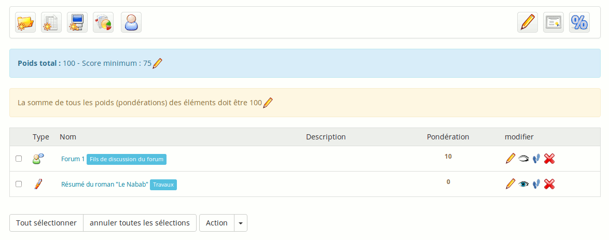

# L&#039;outil « Cahier de notes » {#l-outil-cahier-de-notes}

Cet outil, anciennement appelé « Évaluations », permet d&#039;établir des **objectifs pédagogiques**, ainsi que de générer des **certificats**. Dans les cas plus avancés d&#039;utilisation du système de gestion des _compétences_ (à activer au niveau de l&#039;administration de la plate-forme), l&#039;outil permet également d&#039;attribuer des compétences aux apprenants inscrits et ayant culminé les objectifs établis.

Il permet de préparer un rapport de compétences qui présentera les résultats des apprenants inscrits au cours. Ces évaluations peuvent être pondérées (coefficient) pour refléter l&#039;importance relative d&#039;un élément par rapport à un autre.

Avant d&#039;aller plus loin dans l&#039;explication de l&#039;outil de cahier de notes, assurez-vous qu&#039;au moins un apprenant est inscrit dans votre cours. C&#039;est pour cette raison que nous avons placé le Chapitre 18\. : L&#039;outil « Utilisateurs » avant ce chapitre. Dans le cadre de ce guide, il sera beaucoup plus simple de procéder par exemples si quelques apprenants sont déjà inscrits dans votre cours. N&#039;oubliez pas que l&#039;apprenant ne pourra de toute façon pas voir le cours si celui-ci est configuré comme cours fermé.

Illustration 106: Cahier de notes - Exemple

Dans la capture d&#039;écran ci-dessous, on peut déjà sentir une certaine complexité. Cet outil est, en effet, l&#039;un des plus complets et complexes à utiliser dans Chamilo, avec les parcours d&#039;apprentissage.

Observons d&#039;abord les messages affichés dans les zones de couleur :

1.  Poids total : 100 – Score minimum : 75

2.  La somme de tous les poids (pondération) des éléments doit être de 100

Ces messages sont accolés d&#039;un crayon nous permettant d&#039;éditer les paramètres correspondants.

En effet : le poids total par défaut du cahier de note est de 100, ce qui signifie que la somme des poids de tous les éléments de ce cahier de notes devrait atteindre 100\. Or, on voit dans la liste du dessous que la pondération est de 10 pour le premier élément (forum) et de 0 pour le second. On a donc 3 solutions :

1.  modifier le poids total par défaut, pour le mettre à 10

2.  modifier le poids respectif des deux éléments (forum et travail) pour qu&#039;ils atteignent 100

3.  ajouter de nouveaux éléments pour un poids additionnel de 90, ce qui nous permettra d&#039;atteindre le poids total attendu de 100.

On a donc différentes solutions à disposition. Libre à chacun d&#039;adopter celle qui lui convient le mieux. Nous en reprenons un exemple dans les sections suivantes...