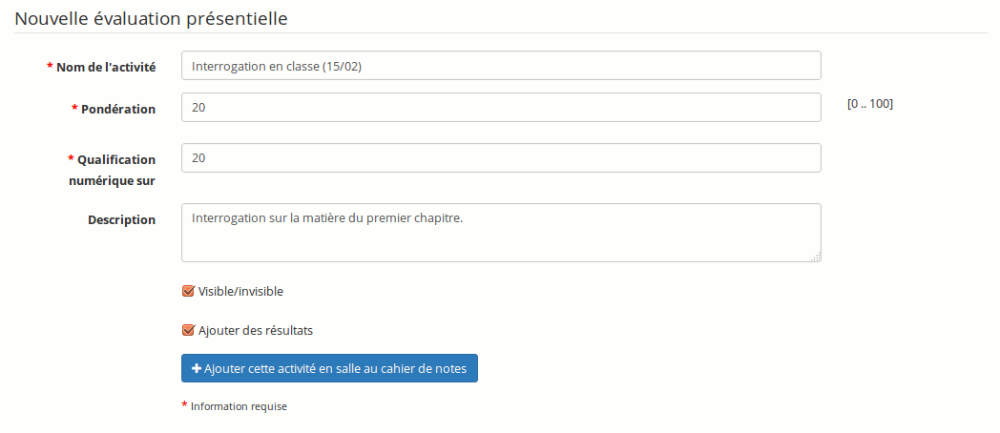
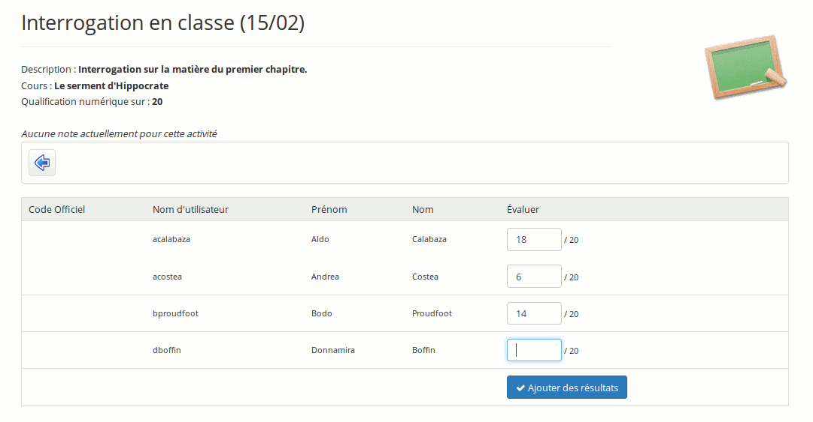
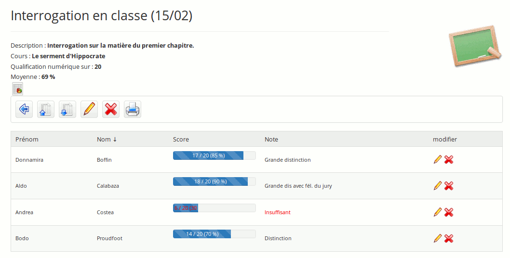

## Ajouter une ressource évaluée {#ajouter-une-ressource-valu-e}

Il est possible, dans Chamilo, d&#039;intégrer des ressources évaluées en dehors de la plate-forme afin qu&#039;elles soient considérées dans le calcul complet des notes obtenues par les apprenants. Pour cela, il vous faudra suivre les indications suivantes.

Sur la page principale de l&#039;outil « Cahier de notes », cliquer sur « Nouvelle évaluation présentielle » (deuxième icône sur la gauche).

Illustration 113: Cahier de notes - Évaluation présentielle

Il vous faudra :

*   lui donner un nom,

*   lui donner une pondération (importance) et une qualification numérique (par exemple sur 20),

*   lui donner une description,

*   rendre l&#039;évaluation visible ou invisible aux apprenants,

*   indiquer si vous désirez y ajouter des résultats directement.

Des résultats pour les évaluations présentielles ne pourront être introduits que si des apprenants sont inscrits dans le cours.

Illustration 114: Cahier de notes - Évaluations présentielles – Encodage des points

Une fois sauvés, les résultats génèrent automatiquement une moyenne et la possibilité de télécharger la feuille de notes.

Illustration 115: Cahier de notes – Évaluations présentielles - Résultats

Les résultats peuvent être modifiés postérieurement, mais les modifications ne sont pas sauvegardées (cela pourrait être l&#039;objet d&#039;une nouvelle fonctionnalité d&#039;une prochaine version de Chamilo).