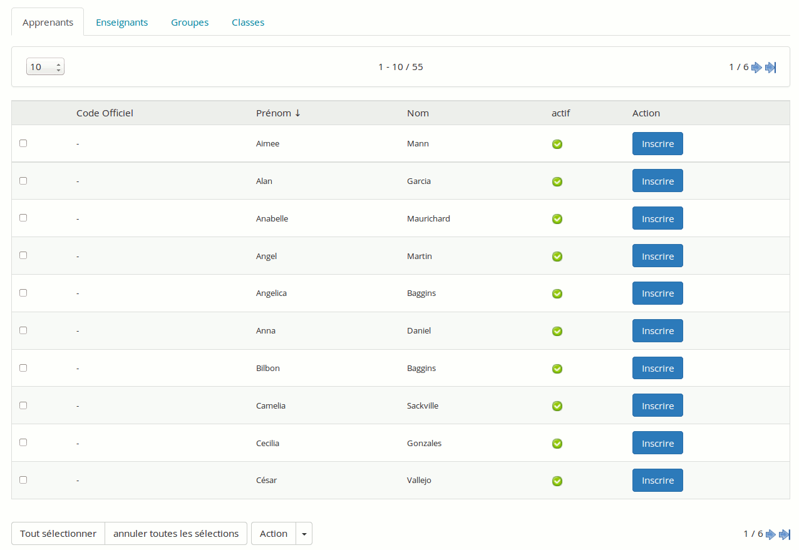
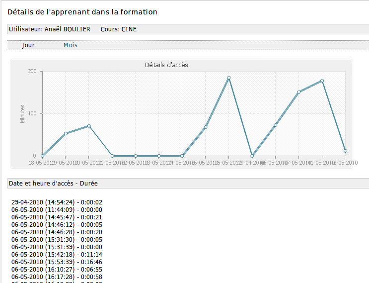

## Inscrire des utilisateurs {#inscrire-des-utilisateurs}

Voyons ensemble comment inscrire des utilisateurs...

*   depuis l’outil « Utilisateurs », dans l&#039;onglet « Apprenant », cliquer sur le lien « Ajouter » (première icône) : la liste des utilisateurs non inscrits au cours apparaît,

*   pour inscrire uniquement une personne au cours, cliquer sur le bouton « Inscrire » situé à droite de la ligne comportant le nom de l&#039;apprenant,

*   pour inscrire plusieurs personnes en une seule opération, cocher le(s) utilisateur(s) à inscrire au cours (colonne de gauche), vérifier que la liste des actions possibles affiche le lien « Inscrire » et cliquer sur le bouton « Sélectionnez »,

*   un message de confirmation s’affiche, ainsi qu’un « feedback » en haut de la page, qui rappelle le nom des apprenants inscrits.

Illustration 104: Utilisateurs - Inscrire des apprenants

### Ajouter des responsables {#ajouter-des-responsables}

L’inscription d’un utilisateur comme enseignant du cours reprend la même procédure que précédemment. Il suffit d’utiliser l&#039;onglet « Enseignants » puis l&#039;icône d&#039;inscription d&#039;utilisateurs.

### Ajouter des groupes {#ajouter-des-groupes}

À partir de la version 1.10, la notion de classe a été regroupée avec la notion de groupe social. Il n&#039;en reste pas moins que la notion de « groupe » au sein d&#039;un cours est différente de la notion de « groupe social », et pour autant, l&#039;écran d&#039;utilisateurs offre l&#039;ajout de groupes et l&#039;ajout de classes sous des onglets différents.

L&#039;ajout d&#039;un groupe, pour autant, se fait via l&#039;onglet de groupes, de la même manière que pour les apprenants.

### Ajouter des classes {#ajouter-des-classes}

L&#039;ajout d&#039;une classe se fait via l&#039;onglet de classes, de la même manière que pour les apprenants.

### Désinscrire un utilisateur {#d-sinscrire-un-utilisateur}

Désinscrire des utilisateurs peut se faire par un traitement individuel ou un traitement par lot.

Pour désinscrire un apprenant unique, depuis la liste des apprenants, cliquez sur le bouton « Supprimer » qui est situé en face du nom du participant à désinscrire. Après demande de confirmation, l&#039;apprenant sélectionné est supprimé de la liste des inscrits au cours,

Pour désinscrire plusieurs utilisateurs en une seule opération, cochez le(s) utilisateur(s) à désinscrire du cours (colonne de gauche), vérifiez que la liste des actions possibles affiche lien « Désinscrire » et cliquez sur le bouton « Sélectionnez ».

La même procédure peut être appliquée pour désinscrire des enseignants, des classes ou des groupes, en utilisant les onglets correspondants.

### Changer un apprenant à assistant {#changer-un-apprenant-assistant}

Dans Chamilo, il est possible de donner à un apprenant du cours un rôle plus prépondérant en le nommant assistant. Il suffit de cliquer sur le bouton «Faire coach» situé en face du nom d’un apprenant,

### Rechercher un apprenant inscrit au cours {#rechercher-un-apprenant-inscrit-au-cours}

Si l&#039;enseignant a besoin de retrouver un apprenant dans la liste des inscrits à un cours, la fonction de recherche permet de retrouver un ou plusieurs utilisateurs à partir de la totalité ou d&#039;une partie de son nom ou de son prénom.

Il suffit de compléter le champ de recherche avec les informations voulues puis de cliquer sur le bouton « Rechercher ». La liste des apprenants, ayant un point commun avec les critères de recherche, apparaîtra.

### Exporter la liste des inscrits au cours {#exporter-la-liste-des-inscrits-au-cours}

Depuis la liste des participants :

*   cliquez sur le lien « Export » (.csv ou .xls) afin de télécharger le fichier qui contient la liste des inscrits au cours,

*   il peut être prudent, indépendamment des sauvegardes planifiées par l’administrateur, de conserver, à intervalle régulier, un enregistrement des participants au cours. Attention toutefois que l&#039;export ainsi généré ne contient pas toutes les informations de l&#039;utilisateur. En particulier, son mot de passe n&#039;est pas exporté étant donné son caractère confidentiel.

### Afficher le suivi détaillé d’un apprenant {#afficher-le-suivi-d-taill-d-un-apprenant}

Une fois la liste des utilisateurs affichée :

*   cliquer sur le bouton « Suivi » situé en face du nom d&#039;un des inscrits au cours,

*   le rapport détaillé des accès au cours de la personne concernée s&#039;affiche,

*   les accès aux différents outils y sont détaillés : documents téléchargés, travaux soumis au responsable, messages envoyés sur les forums de discussion etc.

Parmi les nombreuses informations disponibles, il est possible de corriger les tests en cliquant sur le bouton « Corriger », situé dans la colonne « Détails » de la zone « Tests », ou d&#039;obtenir le détail des accès aux cours, en cliquant sur le bouton situé dans la colonne « Détails » en face de chaque nom de parcours. Le rapport de suivi offre une vue de synthèse de la participation, qui est utile pour juger de l&#039;implication individuelle dans le cours.

Illustration 105: Utilisateurs - Détails d&#039;accès

Depuis cet écran, il est possible :

*   d&#039;exporter le rapport de suivi,

*   d&#039;envoyer un courriel pour relancer l&#039;apprenant,

*   d&#039;imprimer le rapport,

*   d&#039;accéder aux « Détails d&#039;accès » :
