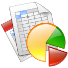
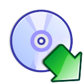

## Outils d&#039;administration {#outils-d-administration}

La section d&#039;administration a pour objectif de réunir les outils que l&#039;étudiant ne verra jamais (parce qu&#039;il n&#039;a pas les permissions qui justifieraient qu&#039;il les voie).

Illustration 24: Outils d&#039;administration

### MagnifierBlogs {#magnifierblogs}

Créer de nouveaux blogs qui seront visibles dans la partie « Production » par les apprenants. Un blog comprend la gestion des tâches et des utilisateurs à l&#039;aide d&#039;un calendrier à l&#039;intérieur de l&#039;outil « Blogs ».

### MagnifierSuivi {#magnifiersuivi}

Cet outil transmet la « fréquentation » des parcours par les apprenants (au cas par cas). Il décrit le temps passé sur le cours, le progrès en pourcentage, son score, ses travaux, le nombre de ses messages et la date de sa dernière connexion.

### MagnifierParamètres {#magnifierparam-tres}

Gérer l&#039;administration du cours en tant qu&#039;enseignant. Il se compose de plusieurs parties :

|  | Paramètres du cours | Permet de changer l&#039;enseignant, le nom, la catégorie et la langue du cours. |
| --- | --- | --- |
|  | Accès à ce cours | Permet de gérer les accès au cours. Elle peut être privée ou publique. En phase de construction, il est préférable de ne pas autoriser les participants à accéder au cours. L&#039;accès « Ouvert à la planète » rend l&#039;accès au cours à quiconque (une vitrine du savoir-faire pédagogique) mais empêche d&#039;envoyer des messages sur le forum, des travaux, etc. |
|  | Alertes par courriel | Permet d&#039;envoyer un courriel à l&#039;enseignant lorsqu&#039;une nouvelle action à été réalisée sur le cours (par exemple, lors de la remise d&#039;un nouveau travail). |
|  | Permissions utilisateurs | Permet aux utilisateurs du cours de modifier l&#039;agenda, les annonces ou simplement d&#039;afficher leur photo dans le forum. |
|  | Configuration de l&#039;outil discuter | Permet d&#039;activer ou de désactiver l&#039;outil de discussion en _popup_ (chat). |
|  | Configuration des parcours | Permet d&#039;autoriser (ou pas) l&#039;activation d&#039;un thème graphique pour le cours, et une série de paramètre relatifs aux parcours. |
|  | Configuration de l&#039;avance thématique | Choisir les informations à donner sur l&#039;avance thématique sur la page d&#039;accueil du cours. |
|  | Configuration de plugins de cours | Dans certains cas, les plugins peuvent offrir des paramètres de configuration propres au cours. Si c&#039;est le cas, chaque plugin correspondant définira une section additionnelle à la suite des sections précédentes. |

### MagnifierMaintenance {#magnifiermaintenance}

Cet outil permet d&#039;exécuter des tâches administratives sur le cours, comme son nettoyage complet, sa copie vers un autre cours, l&#039;import de données sauvegardées ou l&#039;export d&#039;une sauvegarde complète.