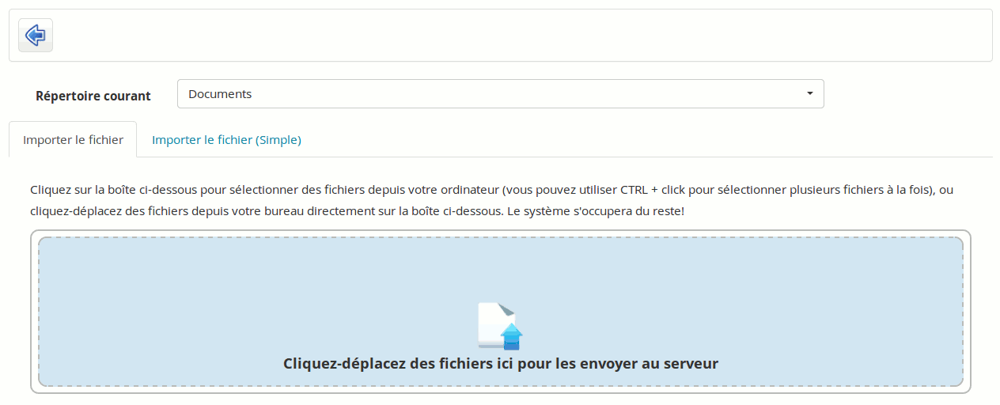
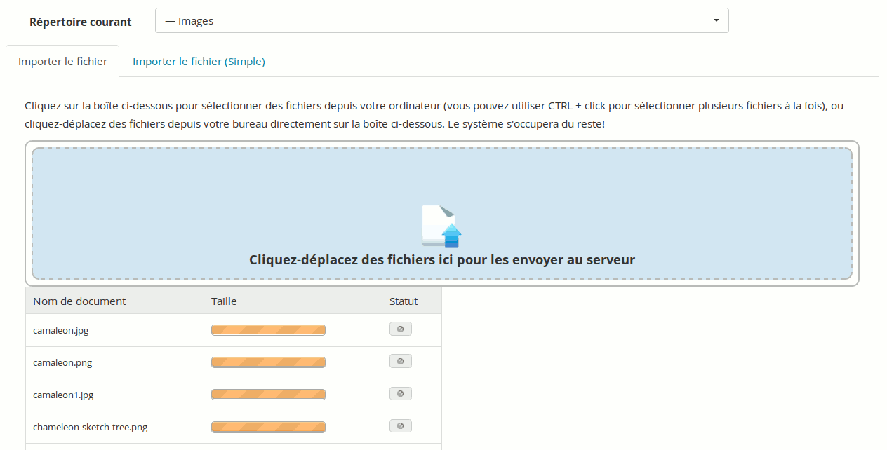
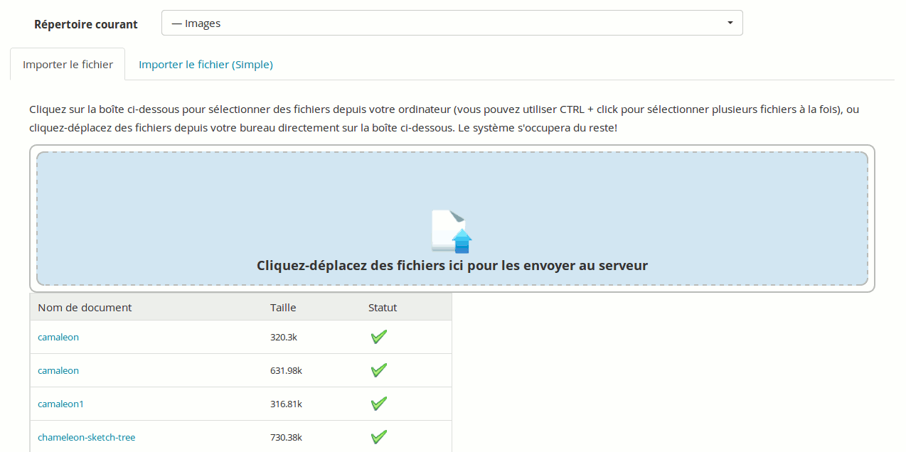

## Importer un document sur la plate-forme {#importer-un-document-sur-la-plate-forme}

En vous positionnant dans le dossier désiré puis en cliquant sur l&#039;icône avec une flèche bleue vers le haut (_Envoyer un document_).

Illustration 27: Document - Icônes - Envoi

Vous retrouverez un écran similaire à l&#039;illustration suivante :

Illustration 28: Documents - Envoi de documents

Cliquez sur la **zone verte** pour explorer l&#039;arborescence de l&#039;ordinateur et sélectionner le (ou les[^5]) document(s) à envoyer et cliquez sur le bouton de validation. L&#039;envoi des documents est alors démarré. Si vous envoyez plusieurs documents à la fois, vous verrez leur progrès à la manière de l&#039;illustration suivante.

Illustration 29: Documents - Envoi de documents en cours

Une fois l&#039;envoi terminé, la liste de validation apparaîtra comme dans l&#039;illustration suivante.

Illustration 30: Documents - Envoi de documents terminé

Voilà qui est fait, vous avez envoyé vos documents dans l&#039;outil de documents de votre cours avec succès. Cliquez maintenant sur l&#039;icône de flèche bleue dirigée vers la gauche pour retourner à la liste de documents.

Note : Un onglet **_Envoyer (Simple)_** vous permet d&#039;utiliser le formulaire d&#039;envoi antérieur. Nous l&#039;avons nommé **_Simple_** car les utilisateurs y sont généralement **plus familiers**, mais il est en réalité légèrement plus compliqué à utiliser. Vous pourrez y trouver également les **options d&#039;indexation** des documents (au cas où votre administrateur aurait activé la recherche indexée) ainsi qu&#039;une option pour décompresser une **hiérarchie entière** (zippée) de documents.

[^5]: Pour sélectionner plusieurs documents, utilisez une combinaison de la touche CTRL et du clic-gauche.