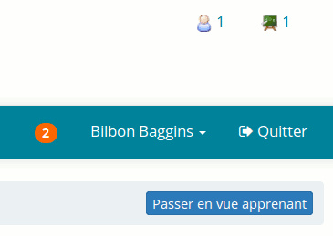
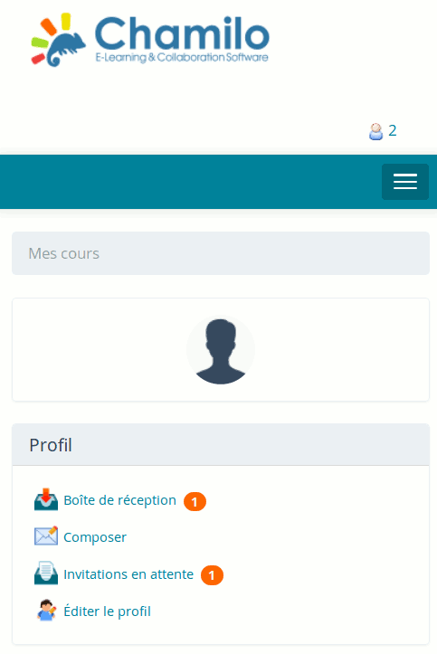
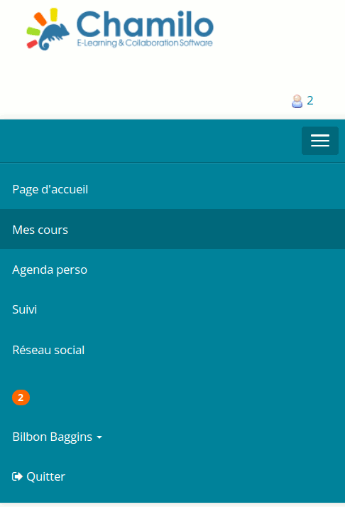

# S&#039;y retrouver dans Chamilo {#s-y-retrouver-dans-chamilo}

Les différentes pages de cours sont accessibles rapidement en utilisant la barre de navigation située en haut de l&#039;écran :

Illustration 7: En-tête de Chamilo

Les onglets permettent d&#039;accéder à la page d’accueil de la plate-forme, la liste des cours, l’édition du profil et aux outils sociaux associés, l’agenda et aux outils de suivi ainsi que de se déconnecter de la plate-forme.

La navigation dans un cours a la même arborescence que dans tous les répertoires d&#039;un ordinateur. Dans Chamilo, nous l&#039;appelons souvent navigation _breadcrumb_, en référence au terme anglais pour _miettes de pain_, en référence, à son tour, au compte du Petit Poucet[^2]. Ce type de navigation permet de se situer et de retrouver son chemin jusqu&#039;à son point de départ.

Le premier lien, à gauche, portant le nom du cours (_Tutoriel_ dans l&#039;exemple suivant), permet de retourner directement à la page d’accueil du cours. Le ou les liens suivants permettent de naviguer au sein de l&#039;outil dans lequel l&#039;utilisateur se trouve.

Illustration 8: Navigation breadcrumb

Au sein d&#039;un cours, la « Vue apprenant » permet à l&#039;enseignant de visionner le cours comme un apprenant. Il suffit ensuite de cliquer sur le lien « Vue prof » pour revenir en vue normal :

Illustration 9: Vue apprenant

À partir de la version 1.9, ce menu se comporte de manière « responsive » (terme utilisé pour exprimer la capacité d&#039;adaptation de l&#039;interface lors de changements de taille d&#039;écran, par exemple avec les tablettes et smartphones), se réduisant pour donner plus de place au contenu.

[^2]: http://fr.wikipedia.org/wiki/Le_Petit_Poucet