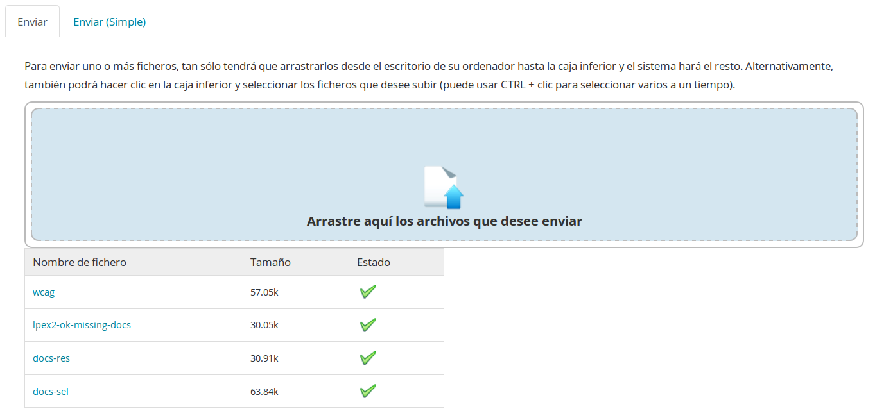

## Importar un documento {#importar-un-documento}

Puedes importar un nuevo documento yendo a la carpeta de destino deseada y haciendo clic en el icono de _Subir documentos_ __.

Ilustración 31: Documentos - Iconos – Subir documentos

Aparece la siguiente pantalla:

Ilustración 32: Documentos – Subida de documentos

Haz clic en el área verde para explorar los archivos en tu disco y selecciona uno(s[^7]) para subir.

En la ventana pop-up, haz clic en el botón de confirmación. La subida comienza. Si envías varios archivos a la vez, verás el progreso de subida de cada uno en tiempo real.

Una vez finalizada la subida, aparece la siguiente lista de validación:

Ilustración 33: Documentos – Subida de documentos finalizada

La marca verde indica que el documento ha sido subido con éxito. Haz clic en el icono con la flecha azul de arriba para volver a la lista de documentos.

Nota : La pestaña de Enviar(Simple) permite utilizar el procedimiento tradicional de “ventana de diálogo” para subir documentos. Lo llamamos **Simple** porque los usuarios en general están más acostumbrados a utilizarlo, ¡aunque es realmente un poco más complicado de utilizar! Las opciones de indexado de documentos pueden solo ser encontradas en el método Simple (en el caso de que tu administrador haya habilitado la característica de búsqueda) así como una opción para descomprimir una jerarquía completa de archivos.

[^7]: Para seleccionar más de un archivo, usa la tecla CTRL en combinación con el botón izquierdo del ratón.